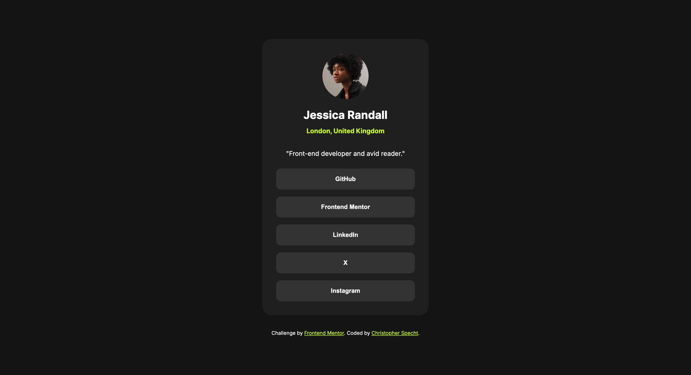
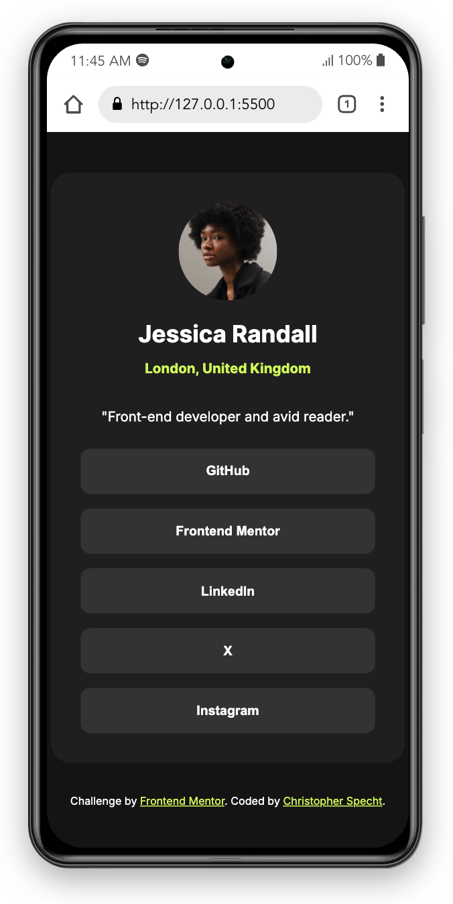

# Frontend Mentor - Social links profile solution

This is a solution to the [Social links profile challenge on Frontend Mentor](https://www.frontendmentor.io/challenges/social-links-profile-UG32l9m6dQ). Frontend Mentor challenges help you improve your coding skills by building realistic projects.

## Table of contents

- [Overview](#overview)
  - [The challenge](#the-challenge)
  - [Screenshot](#screenshot)
  - [Links](#links)
- [My process](#my-process)
  - [Built with](#built-with)
  - [What I learned](#what-i-learned)
  - [Continued development](#continued-development)
- [Author](#author)

## Overview

### The challenge

Users should be able to:

- See hover and focus states for all interactive elements on the page

### Screenshot




### Links

- Solution URL: [GitHub Repository](https://github.com/ctspecht12/FM-social-links-profile)
- Live Site URL: [Live Site](https://ctspecht12.github.io/FM-social-links-profile/)

## My process

### Built with

- Visual Studio Code

### What I learned

I haven't worked a lot with buttons, so I learned how to create buttons with URL links
by using the onclick="location.href..." function:

````
<button class="button" onclick="location.href='https://frontendmentor.io.com'" type="button">Frontend Mentor</button>
````

### Continued development

I want to continue to learn about button functions and move into javascript more to increase my knowledge there.


## Author
- Frontend Mentor - [@ctspecht12](https://www.frontendmentor.io/profile/ctspecht12)


